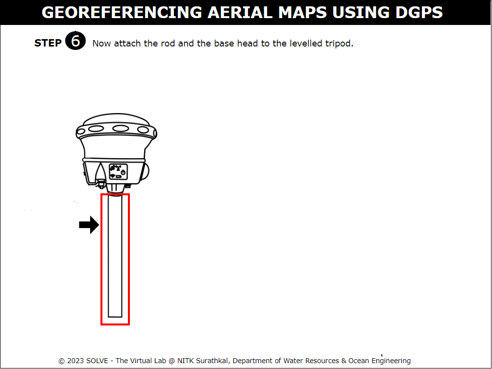
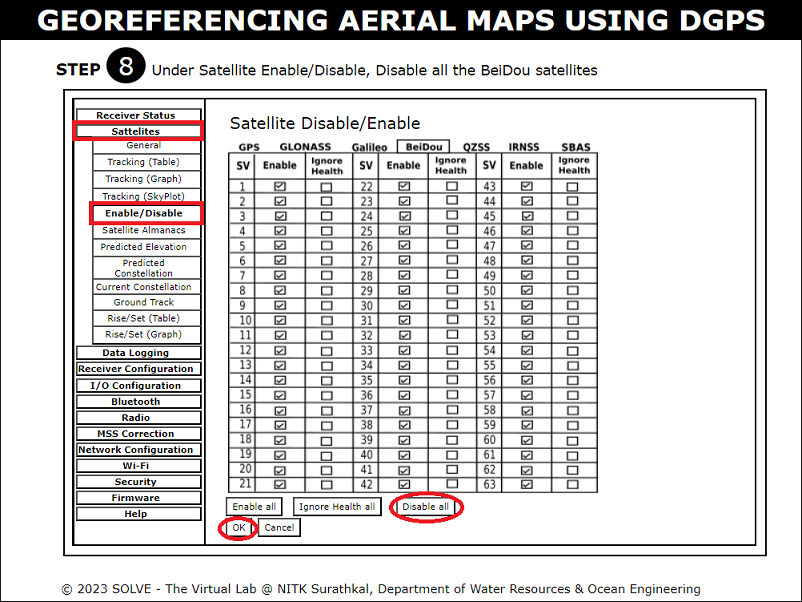
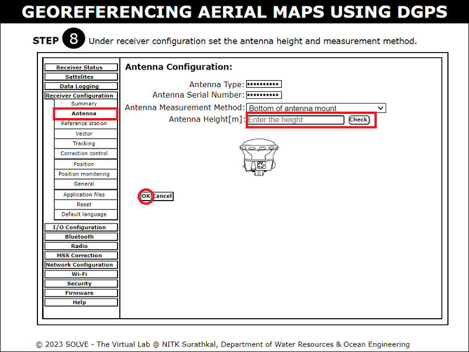

Step by step procedure to carry out the experiment goes here

1. When you open Setting up the Base Station simulation, a window will open as shown below, click on Description to understand the terminologies, click on NEXT button to proceed.

2. Click on the bag to takeout the tripod stand.

3. Click on the bottom of the tripod stand to fix the tip.

4. The tip is fixed to the tripod stand.Click on the next button to proceed.

5. Click on the tripod stand to make it vertical.

6. Click on the screw to unclamp the tripod legs.

7. The screw is unclamped and the leg length is increased to the required height.Click on the next button to proceed.

8. Click on the tripod to place it at the required point.

9. Click on the bottom to release the central drop stand to touch the ground.

10. The tripod stand is placed at the required point.Click on the next button to proceed.

11. Click on the adjustment springs to bring the bubble to the centre to make it truly vertical.

12. Select the correct answer to proceed with the simulation.

13. Click on the next button to proceed.

14. Click on the lid of the base to open it.

15. Click on the battery to insert it to the base.

16. Click on the lid of the base to close it.

17. Click on the next button to proceed.

18. Click on the base to attach the rod.

19. Click on the rod to attach it to the levelled tripod.

20. Select the correct answer to proceed with the simulation.

21. Click on the next button to proceed.

22. Click on the bottom to observe the height of the stand.

23. Select the correct answer to proceed with the simulation.

24. Click on the next button to proceed.

25. Setting up of base station at required location is complete. Click on the next button to proceed.

26. Click on the internet access button to connect to base Wi-Fi. Then click on the chrome website.

27. Enter the username and password to login and click on OK.

28. Under the satellite tab click on Enable/Disable. Then click on BeiDou and give disable all.

29. Click on Receiver configuration to set antenna height. Then click on OK.

30. Click on the reference station, then click on “Here” button and click OK.

31. Open data logging and click on enable to login the data. Then click on the enabled button to log off the data.

32. Click on the bag to open the instruments out of the bag.

33. Click on the rover stand to join the rover stand together.

1.  Click on the opening of the battery to insert the battery to the rover head.

1.  Click on the battery to insert it into rover head. Then click on the opening to close.

36. Click on the rover head to fix it on the rover stand.

37. Click on the rover to place it on the required point, then click on the bipod stand to attach it on the rover stand. Click on the bipod stand to make it truly vertical.

38. Click on the connect to login the data. Data login procedure for Rover is same as followed for Base.

39. Click on the “Import” button to import the images captured during the photogrammetry survey.

40. Click on the “Aerial triangulation” button to process the uploaded images.

41. Click on the “Upload GCP file”, a file in csv format will be displayed. Then click on the upload button to upload the file.

42. Click on the “Mark GCP” button, a marked gcp will be displayed

43. Click on the GCP point, a zoomed image will be displayed. Then click on the target to mark the point. Repeat it for other gcp points.

44. Click on the reoptimize to georeference the map.

45. Click on the “DEM” button provided below to view DEM map.

46. Click on the “Orthomosaic map” button provided below to view Orthomosaic map

