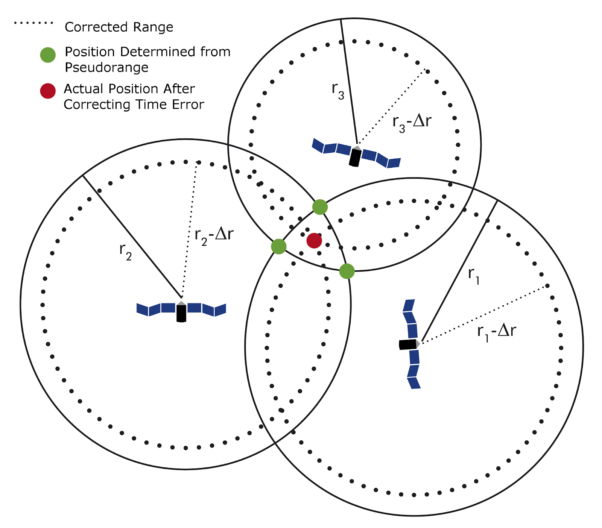
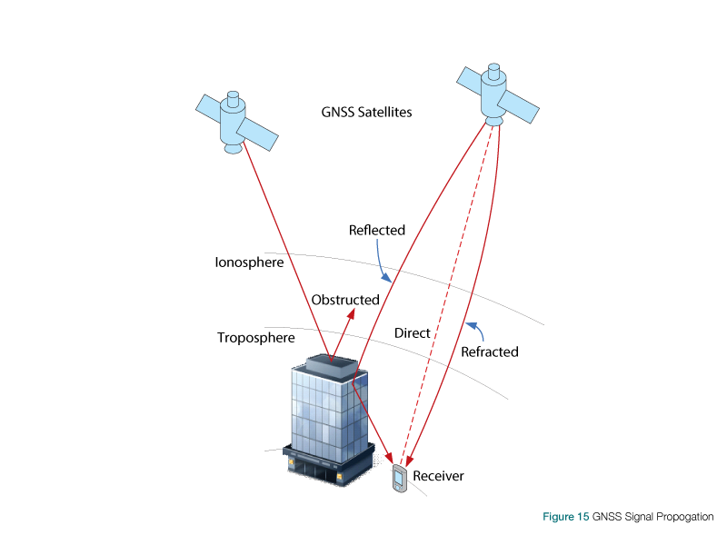

### Introduction

What is DGPS?

An enhancement to the Global Positioning System (GPS) which provides improved location accuracy, in the range of operations of each system, from the 15m nominal GPS accuracy to about 1–3 cm in case of the best implementations.

DGPS uses a network of fixed ground-based reference stations to broadcast the difference between the positions indicated by the GPS satellite system and known fixed positions.

DGPS (Differential GPS) is essentially a system to provide positional corrections to GPS signals. DGPS uses a fixed, known position to adjust real-time GPS signals to eliminate pseudorange errors.

GPS signals coming from satellites down to the ground have to travel through layers of the earth’s atmosphere - subjected to delays.

Affects the time taken for the signal to travel from any given satellite to a GPS receiver.

The error in distance due to this phenomenon is called pseudorange errors.

These corrections are then transmitted to the receivers which are usually short range.

  
  
  
  Pseudorange error correction mechanism in DGPS System
  

Errors that can be compensated with DGPS system are:

Signal noise 0-30m - All removed

Clock drift 0-1.5m - All removed

Multipath 0-1m - All removed

Ephemeris data 1-5m - All removed

Troposphere 0-30m - All removed

Ionosphere 0-30m - Mostly removed

  
 Image depicting various sources of error in GPS Signals
  
 

